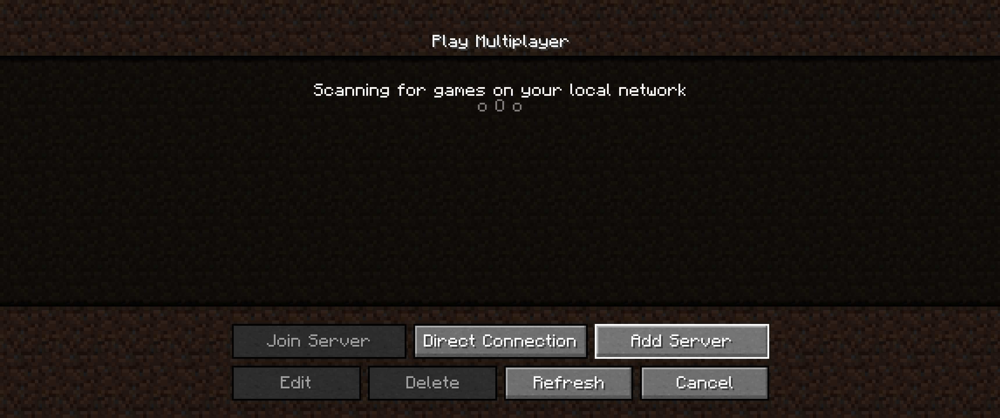
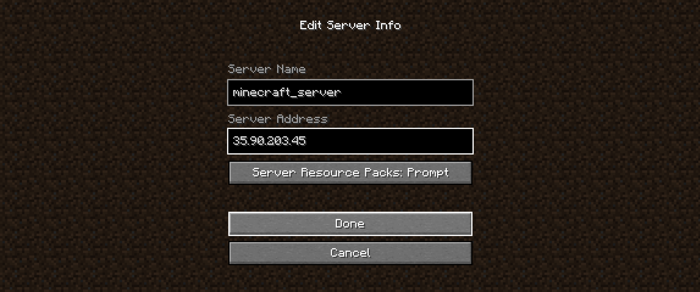
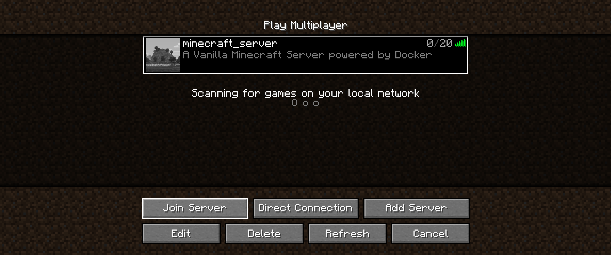
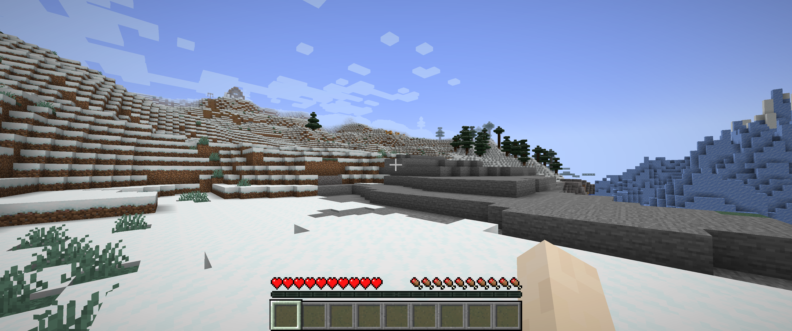

# Minecraft Server
## Background

### What are we doing?

We're making a Minecraft server by using an AWS EC2 instance that can auto-reboot and can shutdown with systemd services.

### How do we do it?

By using Git/Github, AWS, AWC Command Line Interface (CLI), Terraform, and Docker. Exciting, right?!


## Requirments:

- A computer or laptop (ideally personal) with WiFi or Ethernet access

- An AWS account

- An up-to-date Minecraft Client (1.19.4)
  - Note: This can all still be accomplished without having Minecraft, but it defeats the purpose.

- Git installed (2.41.0)
    - Linux: `sudo apt install git-all` or `sudo dnf install git-all`
    - MacOS: `git --version`
    - Windows: [Installation Link](https://git-scm.com/download/win)
    - [Help](https://git-scm.com/book/en/v2/Getting-Started-Installing-Git)

- AWC CLI installed (2.0)
    - Linux: `curl "https://awscli.amazonaws.com/awscli-exe-linux-x86_64.zip" -o "awscliv2.zip"
            unzip awscliv2.zip
            sudo ./aws/install`
    - MacOS: `curl "https://awscli.amazonaws.com/AWSCLIV2.pkg" -o "AWSCLIV2.pkg"
            sudo installer -pkg AWSCLIV2.pkg -target /`
    - Windows: `msiexec.exe /i https://awscli.amazonaws.com/AWSCLIV2.msi`
    - [Help](https://docs.aws.amazon.com/cli/latest/userguide/getting-started-install.html)

- Terraform installed (1.4.6)
    - Linux - Debian-based: [Script](https://github.com/awhittle2/Minecraft-2.0/blob/scripts/linux-terraform-install.sh)
    - Linux - RHEL-based: [Script](https://github.com/awhittle2/Minecraft-2.0/blob/scripts/linux-terraform-install2.sh)
    - MacOS: [Script](https://github.com/awhittle2/Minecraft-2.0/blob/scripts/mac-terraform-install.sh)
    - Windows - Chocolatey: `choco install terraform`
    - [Help](https://developer.hashicorp.com/terraform/tutorials/aws-get-started/install-cli)


Sources used to help: https://github.com/darrelldavis/terraform-aws-minecraft, https://github.com/itzg/docker-minecraft-server

## List of Commands

```bash
# Clone repository
git clone https://github.com/murchej/CS312_Final_Project.git
cd CS312_Final_Project

# Configure your AWS credentials
```
You will need your:
- AWS Access Key ID
- AWS Secret Access Key
- AWS Session Token

To find them:
1. Start your AWS Learner Lab
2. Click on `AWS Details`
3. Click on `AWS CLI: Show`


```bash

# Enter the following command into terminal
aws configure

# Enter your credentials/configurations when prompted
AWS Access Key ID [None]:
AWS Secret Access Key [None]:
Default region name [None]: us-west-2
Default output format [None]: text

# Another option for entering credentials:
cd ~
cd .aws
notepad credentials
```
`Copy and paste whole AWS CLI: Show section into file`

```bash
# Double check that main.tf is in the directory
ls

# Initialize the terraform project
terraform init

# Apply any changes made
terraform apply

# Enter 'yes' when prompted

#Sit tight, it takes a minute or two to create the instance and run the script.

```
When the script is done and the IP address is printed out:
1. Open Minecraft
    
2. Go to multiplayer
    
3. Add Server
    
4. Server Name: `<instance name>`
5. Server Address: `<instance_ip_addr>`
    
6. Done, then join server
    
    
    
- Go get those diamonds!

```bash
# Test to see if the server auto-starts on reboot
aws ec2 reboot-instances --instance-ids i-`instance_id`

terraform refresh
```

## The Terraform Script

Section 1.

```
terraform {
  required_providers {
    aws = {
      source  = "hashicorp/aws"
      version = "~> 4.16"
    }
  }

  required_version = ">= 1.2.0"
}
```

This first small part is simply a requirement by Terraform for the resources and versions.

Section 2.

```
provider "aws" {
  region = "us-west-2"
  shared_credentials_files = ["~/.aws/credentials"]
  shared_config_files      = ["~/.aws/config"]
  profile                  = "default"
}


resource "aws_key_pair" "mykey" {
  key_name   = "mykey"
  public_key = file("mykey.pub")
}
```

Section 2 is for defining the region of your instance (I went with us-west-2, but choose what is closest for you). The second part of it is for defining the keypair resource. For this, I entered the command: ssh-keygen -t rsa -b 2048 -f mykey and then changed the permissions on the .pub key.


Section 3.

```
resource "aws_security_group" "minecraft_sg" {
  ingress {
    from_port   = 25565
    to_port     = 25565
    protocol    = "tcp"
    cidr_blocks = ["0.0.0.0/0"]
  }
  ingress {
    from_port = 22
    to_port = 22
    protocol = "tcp"
    cidr_blocks = ["0.0.0.0/0"]
  }

  ingress {
    from_port = 80
    to_port = 80
    protocol = "tcp"
    cidr_blocks = ["0.0.0.0/0"]
  }

  egress {
    from_port = 0
    to_port = 0
    protocol = "-1"
    cidr_blocks = ["0.0.0.0/0"]
  }
  tags = {
    Name = "MinecraftServ"
  }
}
```

This is the security group section, VERY important. You need to make sure that you configure the proper inbound rules to allow for ssh connections(port 22), http connections (port 80), and all connections in the 25565 range.


Section 4.

```
resource "aws_instance" "minecraft_server" {
  ami           = "ami-03f65b8614a860c29"
  instance_type = "t3.small"
  vpc_security_group_ids = [aws_security_group.minecraft_sg.id]
  associate_public_ip_address = true
  key_name = aws_key_pair.mykey.key_name
  user_data = <<-EOF
  #!/bin/bash
  # Update system
  sudo apt-get update

  # Install dependencies
  sudo apt-get install ca-certificates curl gnupg

  # Setup Docker repository
  sudo install -m 0755 -d /etc/apt/keyrings
  curl -fsSL https://download.docker.com/linux/ubuntu/gpg | sudo gpg --dearmor -o /etc/apt/keyrings/docker.gpg
  sudo chmod a+r /etc/apt/keyrings/docker.gpg
  echo "deb [arch=\"$(dpkg --print-architecture)\" signed-by=/etc/apt/keyrings/docker.gpg] https://download.docker.com/linux/ubuntu $(. /etc/os-release && echo \"$VERSION_CODENAME\") stable" | sudo tee /etc/apt/sources.list.d/docker.list > /dev/null

  # Update system again
  sudo apt-get update

  # Install Docker Engine
  sudo apt-get install -y docker-ce docker-ce-cli containerd.io docker-buildx-plugin docker-compose-plugin

  # Install Docker Compose
  sudo apt-get install -y docker-compose

  # Setup Minecraft directory
  mkdir /home/ubuntu/minecraft_directory
  cd /home/ubuntu/minecraft_directory

  # Create docker-compose.yml file
  cat << DOCKER_COMPOSE > docker-compose.yml
  version: "3"

  services:
    mc:
      image: itzg/minecraft-server:java17-alpine
      ports:
          - 25565:25565
      environment:
          EULA: "TRUE"
      tty: true
      stdin_open: true
      restart: unless-stopped
      volumes:
          - ./minecraft-data:/data
  DOCKER_COMPOSE
  # Start the server
  sudo docker-compose up -d

  # Create systemd service
  sudo bash -c 'cat > /etc/systemd/system/minecraft.service << SYSTEMD_SERVICE
  [Unit]
  Description=Minecraft Server
  After=docker.service
  Requires=docker.service

  [Service]
  WorkingDirectory=/home/ubuntu/minecraft_directory
  ExecStart=/usr/bin/docker-compose up
  ExecStop=/usr/bin/docker-compose down
  Restart=always
  User=ubuntu
  Group=docker

  [Install]
  WantedBy=multi-user.target
  SYSTEMD_SERVICE'

  # Wait for 3.5 minutes
  sleep 210

  # Enable and start the service
  sudo systemctl enable minecraft
  sudo systemctl start minecraft
EOF
  tags = {
    Name = "MinecraftServ"
  }
}
```

Its a large section, but it is fairly straight forward as the scripts are all provided. The script automates the setup of an AWS EC2 instance, including the OS image, instance type, security group rules, key pair, IP address auto-assignment, and a startup script that installs Docker dependencies, initializes the Minecraft server using Docker compose, and creates a service for server management.


Section 5.

```
output "instance_ip_addr" {
  value = aws_instance.minecraft_server.public_ip
  description = "The public ip address of the instance"
}

output "instance_id" {
  value = aws_instance.minecraft_server.id
  description = "The ID of the instance"
}
```

All section 5 does is print out the ip address and server id of the instance, purely for your convienence.